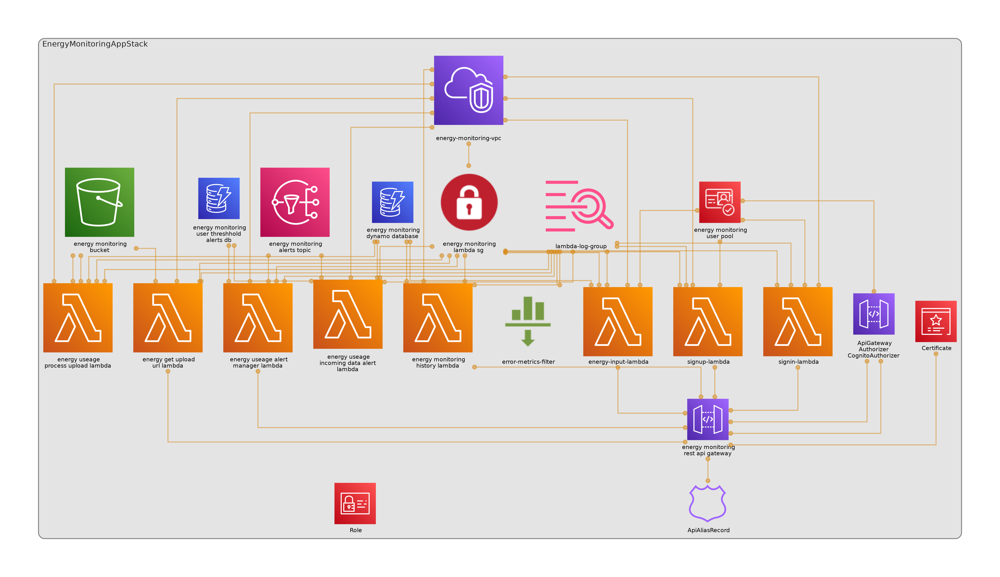

# Energy Monitoring API

This is the Energy monitoring API developed with Lambdas and other AWS technologies.



see the architecture diagram in the root directory as well.

## Postman collection

A postman collection is provided [here](api.postman_collection.json). Use it to test the api to see it working end to end.

## Deploying the API

I chose CDK as my IAC solution to deploy the API. To deploy the app do the following(assuming you have an AWS account and account credentials setup correctly in your terminal):

```bash
npx cdk bootstrap

npm run synth

npm run deploy
```

And it should deploy the API for you. You may run into some snags with CDK but just in case you can destroy your stacks with:

```bash
npx cdk destroy
```

Then try to redeploy it again with just `npm run deploy`. No need to re-run `npm run bootstrap` and `npm run synth` again when you did it for the first time.

After that go into the Cloudformation console and search for the EnergyApiMonitoring stack outputs for the API gateway URL. Or you can even just go to the API Gatway to find it as well.

### Environment Variables

I have some environment variables that I have for if you ever want to use a domain name. It was easier to me than having to search the CDK outputs for the 

## API Documentation

You can find the api documentation at the root directory [here](openapi.yaml) within the project in OpenApi 3.0 docs form in YAML. 

## Useful project commands

* `npm run build`   compile typescript to js
* `npm run watch`   watch for changes and compile
* `npm run test`    perform the vite unit tests
* `npx cdk deploy`  deploy this stack to your default AWS account/region
* `npx cdk diff`    compare deployed stack with current state
* `npx cdk synth`   emits the synthesized CloudFormation template
